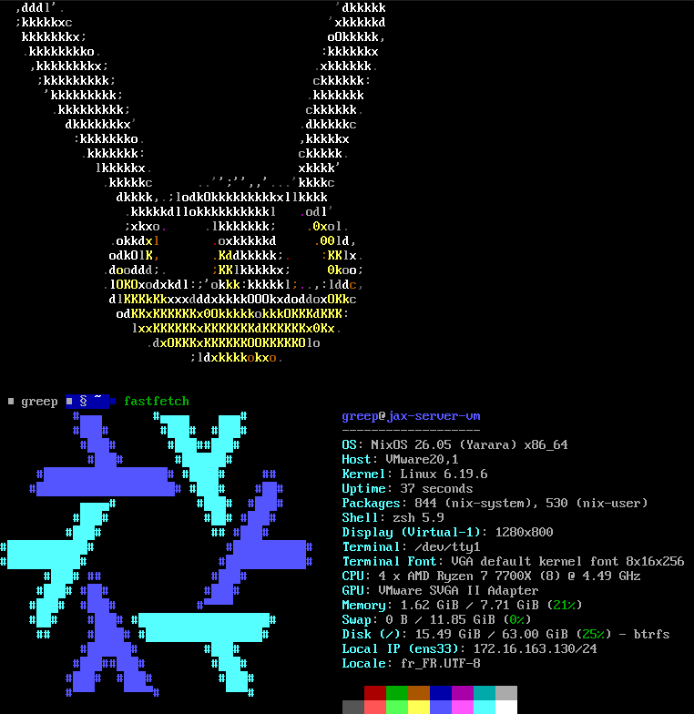

# Greep's NixOS Configuration

## Installation

Use the `full_install.sh` script using `bash`

## Build the Live ISO

`sudo nix build .#nixosConfigurations.liveIso.config.system.build.isoImage`

## Sops Secrets (age)

Secrets are encrypted with [sops-nix](https://github.com/Mic92/sops-nix) using **age** keys derived from each host's SSH key.

To add a new host:

1. Get the host's age public key: `nix-shell -p ssh-to-age --run 'cat /etc/ssh/ssh_host_ed25519_key.pub | ssh-to-age'`
2. Add the key to `.sops.yaml` under `keys` and `creation_rules`.
3. Get the host's age private key: `sudo nix-shell -p ssh-to-age --run 'cat /etc/ssh/ssh_host_ed25519_key | ssh-to-age --private-key'`
4. Add the private key to a secure location like `/root/.secrets/keys.txt`
5. Re-encrypt secrets: `sudo SOPS_AGE_KEY_FILE=/root/.secrets/keys.txt nix-shell -p sops --run 'sops updatekeys secrets/secrets.yaml'`
6. Edit secrets: `sudo SOPS_AGE_KEY_FILE=/root/.secrets/keys.txt nix-shell -p sops --run 'EDITOR=nano sops secrets/secrets.yaml'`

## Wallpaper credits:

* [Stolas](wallpaper/stolas.png) by [@LANVERIL](https://linktr.ee/LANVERIL) ([X Post](https://x.com/LANVERIL/status/1561363128981471232), [Pixiv Post](https://www.pixiv.net/en/artworks/100669341))
* [N & Uzi](wallpaper/nuzi.jpg) by [@SaltyPepper](https://allmylinks.com/SaltyPepper) ([X Post](https://x.com/SaItyPepper/status/1819875736322183469))
* [Greep's background](wallpaper/greep_background_3840x1080.png) by [Greep](https://greep.fr)