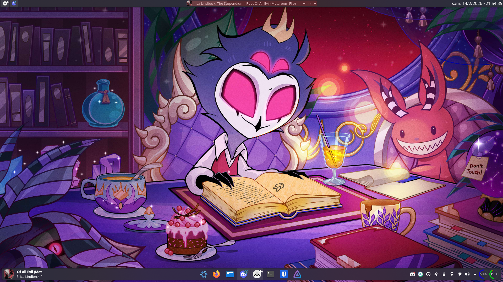

# Greep's NixOS Configuration

## Installation

To install this configuration on a new machine:

1. Boot into a NixOS live environment.
2. Partition and mount your disks to `/mnt`.
3. Generate hardware config: `nixos-generate-config --root /mnt`
4. Copy this repository to `/mnt/etc/nixos/` (or clone it).
5. Install: `nixos-install --flake /mnt/etc/nixos#nixos-custom`

## Build the Live ISO

`sudo nix build .#nixosConfigurations.liveIso.config.system.build.isoImage`

## Sops Secrets (age)

Secrets are encrypted with [sops-nix](https://github.com/Mic92/sops-nix) using **age** keys derived from each host's SSH key.

To add a new host:

1. Get the host's age public key: `nix-shell -p ssh-to-age --run 'cat /etc/ssh/ssh_host_ed25519_key.pub | ssh-to-age'`
2. Add the key to `.sops.yaml` under `keys` and `creation_rules`.
3. Get the host's age private key: `sudo nix-shell -p ssh-to-age --run 'cat /etc/ssh/ssh_host_ed25519_key | ssh-to-age --private-key'`
4. Add the private key to a secure location like `/root/.secrets/keys.txt`
5. Re-encrypt secrets: `sudo SOPS_AGE_KEY_FILE=/root/.secrets/keys.txt sudo nix-shell -p sops --run 'sops updatekeys secrets/secrets.yaml'`
6. Edit secrets: `nix-shell -p sops --run 'sops secrets/secrets.yaml'`
